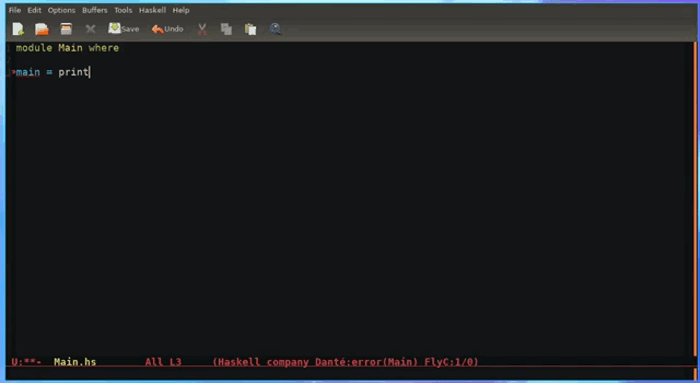

# minimal-haskell-emacs

A minimal emacs configuration for haskell programming using [dante](https://github.com/jyp/dante) and friends.

* Coming from Vim? Try the [evil branch](https://github.com/soupi/minimal-haskell-emacs/tree/evil) which includes vim key bindings

[](https://www.youtube.com/watch?v=Ig5k3UkfvZ4)

[Visit dante's README.org to see the features list for Haskell editing](https://github.com/jyp/dante/blob/master/README.org).

Package management approach is based on [this tutorial](http://y.tsutsumi.io/emacs-from-scratch-part-2-package-management.html).

To get a haskell compiler, I recommend downloading [Stack](https://haskell-lang.org/get-started) and running `stack setup` to install GHC.

Since `stack setup` does not install ghci in the global environment, you may want to run this command to create a `~/.local/bin/ghci` executable that will run with the global stack environment:

```sh
if [ ! -f ~/.local/bin/ghci ]; then
    echo '#!/bin/bash' > ~/.local/bin/ghci;
    echo 'stack exec -- ghci $@' >> ~/.local/bin/ghci;
    chmod +x ~/.local/bin/ghci;
    echo "~/.local/bin/ghci created."
else
    echo "~/.local/bin/ghci already exists."
fi
```

Optional: If you want to add `ghc` and `runghc` as well, use:

```sh
if [ ! -f ~/.local/bin/ghc ]; then
    echo '#!/bin/bash' > ~/.local/bin/ghc;
    echo 'stack exec -- ghc $@' >> ~/.local/bin/ghc;
    chmod +x ~/.local/bin/ghc;
    echo "~/.local/bin/ghc created."
else
    echo "~/.local/bin/ghc already exists."
fi

if [ ! -f ~/.local/bin/runghc ]; then
    echo '#!/bin/bash' > ~/.local/bin/runghc;
    echo 'stack exec -- runghc $@' >> ~/.local/bin/runghc;
    chmod +x ~/.local/bin/runghc;
    echo "~/.local/bin/runghc created."
else
    echo "~/.local/bin/runghc already exists."
fi
```

To install this configuration, clone the repository and place the following files at your home directory:

- `.emacs` - emacs will call this file first which will trigger the whole thing. Also contains a few convenient tweaks.
- `.emacs.d/my-packages.el` - contains the list of packages to install when starting emacs
- `.emacs.d/my-loadpackages.el` - defines how to enable and setup the packages we use

**WARNING: Backup your changes to all your emacs related files before running the following commands as they will override your files!**

So the steps are:

```
git clone https://github.com/soupi/minimal-haskell-emacs
cp minimal-haskell-emacs/.emacs  ~/
cp -r minimal-haskell-emacs/.emacs.d ~/
```

Now just run Emacs and start hacking!

---

### Extra useful shortcuts:

Files:

- `F8` - Toggle [neotree](https://github.com/jaypei/emacs-neotree)

Buffers:

- `F7` - Open buffers list
- `C-backtick` / `C-~` - next / previous buffer

Windows:

- `C-tab` - switch window
- `M-<arrow>` - move to window in direction

Haskell:

- `C-:` - In a haskell buffer, search this word in hoogle
- `M-,` - Jump back after 'Goto definition' (`M-.`)
